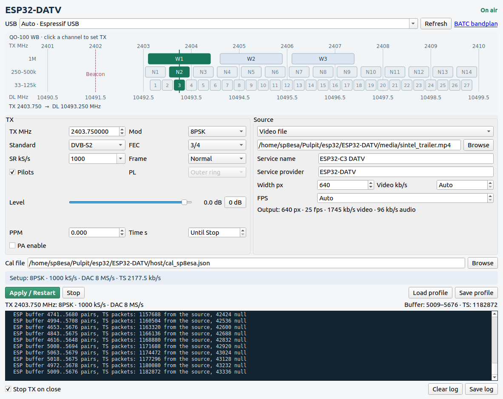
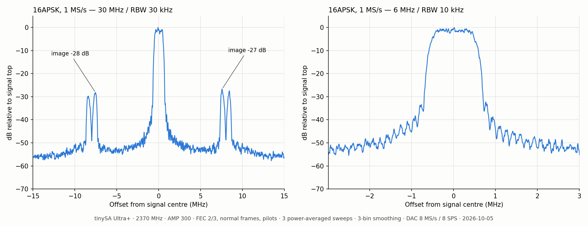
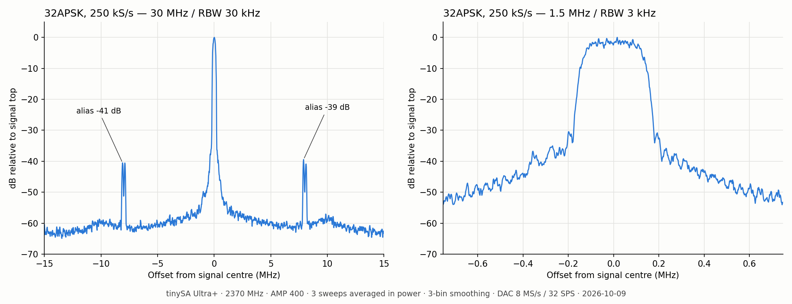
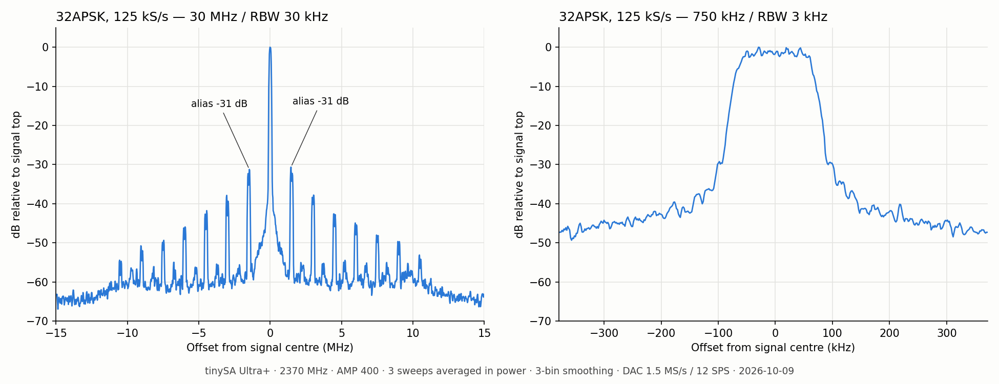
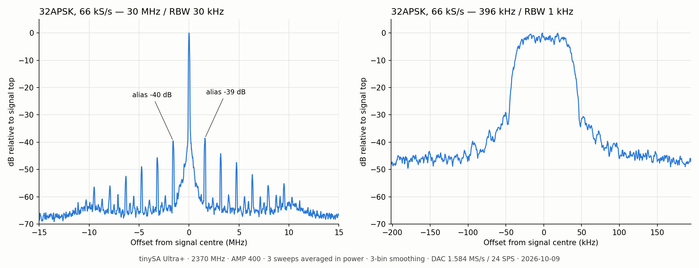
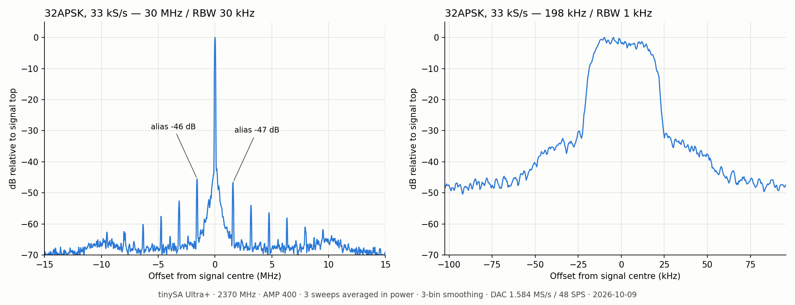

<p align="center"></p>

# ESP32-DATV

DVB-S / DVB-S2 video transmitter using the ESP32-C3's own 2.4 GHz RF hardware.

## How it works

The PC uses FFmpeg to make an MPEG transport stream, applies DVB-S or DVB-S2 encoding,
and sends symbols over native USB. The ESP32-C3 applies a root-raised-cosine filter
(roll-off 0.35) and writes I/Q samples directly to the Wi-Fi DAC. The chip's RF block
produces the transmitted signal; no external modulator is needed.

Common symbol rates:

| Modulation | Standard | Symbol rates (kS/s) | Status |
|---|---|---|---|
| QPSK | DVB-S, DVB-S2 | 33, 66, 125, 250, 333, 500, 1000 | Working |
| 8PSK | DVB-S2 | 33, 66, 125, 250, 333, 500, 1000 | Working |
| 16APSK | DVB-S2 | 33, 66, 125, 250, 333, 500, 1000 | Working |
| 32APSK | DVB-S2 | 33, 66, 125, 250 | Working; RX details below |

The firmware averages CPU cycle intervals where needed to obtain the requested mean
symbol rate. Crystal error remains; set `--ppm` for your board. The DAC sample rate
is selected automatically and depends on modulation and symbol rate.
32APSK at 250 kS/s uses 8 MS/s (32 SPS); narrower 32APSK modes use the slower C loop.

## Installation

You need an ESP32-C3 board with native USB Serial/JTAG, a Linux PC, Python 3 and FFmpeg.
Install and activate [ESP-IDF](https://docs.espressif.com/projects/esp-idf/en/latest/esp32c3/get-started/index.html)
(tested with 6.2.0), then build and flash:

```sh
git clone https://github.com/SP8ESA/ESP32-DATV.git
cd ESP32-DATV/firmware
idf.py set-target esp32c3
idf.py -p /dev/ttyACM0 build flash
cd ..
```

Install the host dependencies from the repository root:

```sh
python3 -m venv .venv
. .venv/bin/activate
python3 -m pip install -r host/requirements.txt
```

Replace `/dev/ttyACM0` with your board's port if necessary.

Prebuilt firmware is available in [Releases](https://github.com/SP8ESA/ESP32-DATV/releases/latest).
Download the firmware ZIP, unzip it and run `./flash.sh /dev/ttyACM0`
(requires `python3 -m pip install esptool`). The bundle targets ESP32-C3 with 4 MB flash.

## Usage

For the desktop GUI, install its dependencies and run:

```sh
python3 -m pip install -r host/requirements-gui.txt
./uruchom_nadajnik.sh
```

<p align="center"><a href="docs/tx_gui.png"></a></p>

The single-panel GUI selects video, TS or a V4L2 camera and controls TX, Start/Stop
and profiles. Click a [QO-100 WB channel](https://wiki.batc.org.uk/QO-100_WB_Bandplan)
to set its uplink frequency; Apply/Restart applies changes to an active transmitter.
The Level slider uses relative dB: 0 dB is the default amplitude for the modulation.
GUI defaults: 0 dB, W1 at 2403.750 MHz, DVB-S2 8PSK at 1 MS/s.
Its minimum is set by `min_level_db` in `host/tx_gui_config.json` (default −27 dB).
PA enable controls GPIO3: 3.3 V during TX, 0 V after Stop or USB timeout.
It defaults to off; use Apply/Restart after changing the checkbox.
Sampling and buffer settings are automatic; I/Q calibration comes from the selected
JSON file. Defaults: 0 ppm, DC I/Q 0, Q gain 1, Q phase 0. The earlier board-specific
example is in `host/cal_sp8esa.json`. Ready TS must fit the channel capacity.
Service name and provider are editable for video, camera, test and TS URL sources;
defaults are `ESP32-C3 DATV` and `ESP32-DATV`. TS files keep their own metadata.

Run from the repository root with `.venv` activated. These examples loop the included
Sintel trailer at 2370 MHz; FFmpeg adjusts the video and audio to the channel capacity.

```sh
# DVB-S, QPSK, 1 MS/s, FEC 1/2
python3 host/tx_dvbs.py --freq 2370 --baud 1000000 --fec 1/2

# DVB-S2, 8PSK, 333 kS/s, FEC 3/5
python3 host/tx_dvbs.py --freq 2370 --baud 333000 --dvbs2 --mod 8psk --fec 3/5

# DVB-S2, 16APSK, 1 MS/s, FEC 2/3
python3 host/tx_dvbs.py --freq 2370 --baud 1000000 --dvbs2 --mod 16apsk --fec 2/3 --pilots

# DVB-S2, 32APSK, 250 kS/s, FEC 3/4
python3 host/tx_dvbs.py --freq 2370 --baud 250000 --dvbs2 --mod 32apsk --fec 3/4 --pilots --apsk-pl unit

# Camera, DVB-S2 32APSK, 250 kS/s
python3 host/tx_dvbs.py --freq 2370 --baud 250000 --dvbs2 --mod 32apsk --fec 3/4 --pilots --apsk-pl unit --camera /dev/video0 --camera-size 640x480 --camera-fps 30 --camera-format mjpeg
```

Set the receiver to the same frequency, standard, modulation, symbol rate and FEC,
with roll-off 0.35. In SDRangel, enable soft LDPC decoding for DVB-S2; restart
the receiver after changing symbol rate if it loses lock. The current 32APSK loop
supports 2–250 kS/s. Use `--apsk-pl unit` with SDRangel: it gives PLHEADER and pilots
their own unit-radius points. The default `outer` keeps the existing outer-ring
normalization. 16APSK is unchanged.
Stop with Ctrl-C; the ESP also stops after about 0.5 seconds without USB data.

Useful options:

| Option | Purpose |
|---|---|
| `--film video.mp4` | Encode and loop your own video |
| `--test` | Generate a test pattern and tone |
| `--ts stream.ts` | Loop an existing constant-bit-rate MPEG transport stream that fits the channel; `--ts -` reads stdin |
| `--port /dev/ttyACM0` | Select the board; otherwise native Espressif USB is preferred |
| `--frame short`, `--pilots` | DVB-S2 short frames or pilots |
| `--apsk-pl outer\|unit` | 32APSK PL amplitude: existing outer-ring scale or unit PL symbols for an E=1 receiver |
| `--ppm N` | Compensate your board's crystal error |
| `--cal file.json`, `--no-cal` | Use your own I/Q calibration or disable the included example calibration |
| `--amp N` | DAC amplitude; defaults: 300 for QPSK, 400 for 32APSK, 420 for 8PSK/16APSK |
| `--pa-enable` | Enable an external PA via GPIO3 while transmitting |
| `--service-name NAME`, `--service-provider NAME` | Service metadata for generated or remuxed TS |

All options: `python3 host/tx_dvbs.py --help`.

Connect GPIO3 to the amplifier's 3.3 V compatible enable input and join grounds.
Use a 10 kΩ pull-down to keep PA disabled during reset. GPIO3 is a logic output;
the amplifier needs its own power supply.

The firmware permits 2300–2450 MHz. For on-air use, choose a frequency allowed by your
amateur licence and add an output filter: DAC images are visible in the plots below.

## Spectra

Measured on 2026-10-05 at 2370 MHz with a tinySA Ultra+, `--amp 300` and null transport
packets: DVB-S QPSK 1/2, DVB-S2 8PSK 3/5 and 16APSK 2/3. Three sweeps averaged in power;
three-bin smoothing for display. [Raw sweeps and CSVs](docs/spectra/) ·
[Measurement settings](docs/spectra/measurement.json).

### QPSK — 33 to 1000 kS/s

<table>
  <tr>
    <td width="50%" align="center"><strong>1 MS/s</strong><br><a href="docs/spectrum_1MBd.png"></a></td>
    <td width="50%" align="center"><strong>500 kS/s</strong><br><a href="docs/spectrum_500kBd.png"></a></td>
  </tr>
  <tr>
    <td width="50%" align="center"><strong>333 kS/s</strong><br><a href="docs/spectrum_333kBd.png"></a></td>
    <td width="50%" align="center"><strong>250 kS/s</strong><br><a href="docs/spectrum_250kBd.png"></a></td>
  </tr>
  <tr>
    <td width="50%" align="center"><strong>125 kS/s</strong><br><a href="docs/spectrum_125kBd.png"></a></td>
    <td width="50%" align="center"><strong>66 kS/s</strong><br><a href="docs/spectrum_66kBd.png"></a></td>
  </tr>
  <tr>
    <td width="50%" align="center"><strong>33 kS/s</strong><br><a href="docs/spectrum_33kBd.png"></a></td>
    <td width="50%"></td>
  </tr>
</table>

### 8PSK — 33 to 1000 kS/s

<table>
  <tr>
    <td width="50%" align="center"><strong>1 MS/s</strong><br><a href="docs/spectrum_8PSK_1MBd.png"></a></td>
    <td width="50%" align="center"><strong>500 kS/s</strong><br><a href="docs/spectrum_8PSK_500kBd.png"></a></td>
  </tr>
  <tr>
    <td width="50%" align="center"><strong>333 kS/s</strong><br><a href="docs/spectrum_8PSK_333kBd.png"></a></td>
    <td width="50%" align="center"><strong>250 kS/s</strong><br><a href="docs/spectrum_8PSK_250kBd.png"></a></td>
  </tr>
  <tr>
    <td width="50%" align="center"><strong>125 kS/s</strong><br><a href="docs/spectrum_8PSK_125kBd.png"></a></td>
    <td width="50%" align="center"><strong>66 kS/s</strong><br><a href="docs/spectrum_8PSK_66kBd.png"></a></td>
  </tr>
  <tr>
    <td width="50%" align="center"><strong>33 kS/s</strong><br><a href="docs/spectrum_8PSK_33kBd.png"></a></td>
    <td width="50%"></td>
  </tr>
</table>

### 16APSK — 33 to 1000 kS/s

At 1 MS/s, the DAC runs at 8 MS/s (8 samples per symbol). The first image peaks are
about 27–28 dB below the main-channel peak, compared with 13–14 dB in the previous
2 MS/s prototype. This measurement includes pilots.
[Settings and raw data](docs/spectra/16apsk_1MBd_measurement.json) ·
[Video reception test](docs/spectra/16apsk_1MBd_validation.json) ·
[Archived 2 MS/s prototype](docs/spectra/16apsk_1MBd_2MSps_prototype/16apsk_1MBd_measurement.json).

<table>
  <tr>
    <td width="50%" align="center"><strong>1 MS/s</strong><br><a href="docs/spectrum_16APSK_1MBd.png"></a></td>
    <td width="50%" align="center"><strong>500 kS/s</strong><br><a href="docs/spectrum_16APSK_500kBd.png"></a></td>
  </tr>
  <tr>
    <td width="50%" align="center"><strong>333 kS/s</strong><br><a href="docs/spectrum_16APSK_333kBd.png"></a></td>
    <td width="50%" align="center"><strong>250 kS/s</strong><br><a href="docs/spectrum_16APSK_250kBd.png"></a></td>
  </tr>
  <tr>
    <td width="50%" align="center"><strong>125 kS/s</strong><br><a href="docs/spectrum_16APSK_125kBd.png"></a></td>
    <td width="50%" align="center"><strong>66 kS/s</strong><br><a href="docs/spectrum_16APSK_66kBd.png"></a></td>
  </tr>
  <tr>
    <td width="50%" align="center"><strong>33 kS/s</strong><br><a href="docs/spectrum_16APSK_33kBd.png"></a></td>
    <td width="50%"></td>
  </tr>
</table>

### 32APSK — 33 to 250 kS/s

Measured on 2026-10-09 with live video, FEC 3/4, pilots, `--apsk-pl unit` and
`--amp 400`. Three sweeps averaged in power; three-bin display smoothing.
[Raw data and settings](docs/32apsk/measurement.json) ·
[Reception results](docs/32apsk/reception.json).

| Symbol rate (kS/s) | DAC (MS/s) | SPS | Video reception test |
|---|---|---|---|
| 250 | 8 | 32 | Decoded; 0 TS continuity errors |
| 125 | 1.5 | 12 | Decoded; 0 TS continuity errors |
| 66 | 1.584 | 24 | Decoded; 10 TS continuity errors in 38 s during spectrum sweeps |
| 33 | 1.584 | 48 | TX and spectrum measured; SDRangel video lock not obtained |

At 250 kS/s, the first image peaks near ±8 MHz are 39.8–40.3 dB below the signal
peak (RBW 10 kHz), about 15.5 dB lower than with the previous 1.5 MS/s DAC.
[Archived 1.5 MS/s measurement](docs/32apsk/dac_1m5/measurement.json).

<table>
  <tr>
    <td width="50%" align="center"><strong>250 kS/s</strong><br><a href="docs/spectrum_32APSK_250kBd.png"></a></td>
    <td width="50%" align="center"><strong>125 kS/s</strong><br><a href="docs/spectrum_32APSK_125kBd.png"></a></td>
  </tr>
  <tr>
    <td width="50%" align="center"><strong>66 kS/s</strong><br><a href="docs/spectrum_32APSK_66kBd.png"></a></td>
    <td width="50%" align="center"><strong>33 kS/s</strong><br><a href="docs/spectrum_32APSK_33kBd.png"></a></td>
  </tr>
</table>

### Amplitude sweep — 8PSK and 16APSK at 500 kS/s

Separate amplitude measurement. Above about `--amp 430`, the output compresses and
out-of-band emissions increase.


## License

[PolyForm Noncommercial License 1.0.0](LICENSE): you may use, modify and share this software for any noncommercial purpose,
including hobby, amateur radio, research and education. Commercial use is not permitted. The demo film has its own licence (CC BY 3.0).

Copyright (c) 2026 SP8ESA
