<p align="center">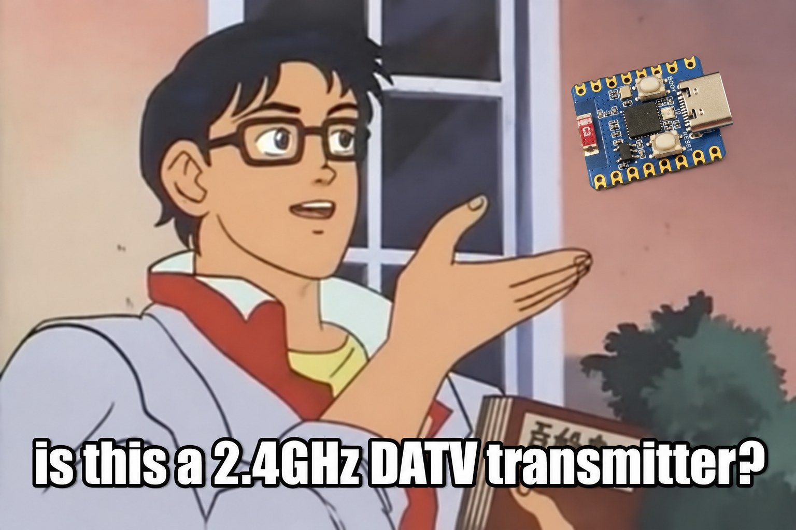</p>

# ESP32-DATV

DVB-S / DVB-S2 video transmitter using the ESP32-C3's own 2.4 GHz RF hardware.

## How it works

The PC uses FFmpeg to make an MPEG transport stream, applies DVB-S or DVB-S2 encoding,
and sends symbols over native USB. The ESP32-C3 applies a root-raised-cosine filter
(roll-off 0.35) and writes I/Q samples directly to the Wi-Fi DAC. The chip's RF block
produces the transmitted signal; no external modulator is needed.

Common symbol rates:

| Modulation | Standard | Symbol rates (kS/s) |
|---|---|---|
| QPSK | DVB-S, DVB-S2 | 33, 66, 125, 250, 333, 500, 1000 |
| 8PSK | DVB-S2 | 33, 66, 125, 250, 333, 500, 1000 |
| 16APSK | DVB-S2 | 33, 66, 125, 250, 333, 500 |

The firmware averages CPU cycle intervals where needed to obtain the requested mean
symbol rate. Crystal error remains; set `--ppm` for your board. The DAC sample rate
is selected automatically and depends on modulation and symbol rate.

## Installation

You need an ESP32-C3 board with native USB Serial/JTAG, a Linux PC, Python 3 and FFmpeg.
Install and activate [ESP-IDF](https://docs.espressif.com/projects/esp-idf/en/latest/esp32c3/get-started/index.html)
(tested with 6.2.0), then build and flash:

```sh
git clone https://github.com/SP8ESA/ESP32-DATV.git
cd ESP32-DATV/firmware
idf.py set-target esp32c3
idf.py -p /dev/ttyACM0 build flash
cd ..
```

Install the host dependencies from the repository root:

```sh
python3 -m venv .venv
. .venv/bin/activate
python3 -m pip install -r host/requirements.txt
```

Replace `/dev/ttyACM0` with your board's port if necessary.

## Usage

Run from the repository root with `.venv` activated. These examples loop the included
Sintel trailer at 2370 MHz; FFmpeg adjusts the video and audio to the channel capacity.

```sh
# DVB-S, QPSK, 1 MS/s, FEC 1/2
python3 host/tx_dvbs.py --freq 2370 --baud 1000000 --fec 1/2

# DVB-S2, 8PSK, 333 kS/s, FEC 3/5
python3 host/tx_dvbs.py --freq 2370 --baud 333000 --dvbs2 --mod 8psk --fec 3/5

# DVB-S2, 16APSK, 66 kS/s, FEC 2/3
python3 host/tx_dvbs.py --freq 2370 --baud 66000 --dvbs2 --mod 16apsk --fec 2/3
```

Set the receiver to the same frequency, standard, modulation, symbol rate and FEC,
with roll-off 0.35. In SDRangel, enable soft LDPC decoding for DVB-S2.
Stop with Ctrl-C; the ESP also stops after about 0.5 seconds without USB data.

Useful options:

| Option | Purpose |
|---|---|
| `--film video.mp4` | Encode and loop your own video |
| `--test` | Generate a test pattern and tone |
| `--ts stream.ts` | Loop an existing constant-bit-rate MPEG transport stream that fits the channel; `--ts -` reads stdin |
| `--port /dev/ttyACM0` | Select the board; otherwise the first `/dev/ttyACM*` is used |
| `--frame short`, `--pilots` | DVB-S2 short frames or pilots |
| `--ppm N` | Compensate your board's crystal error |
| `--cal file.json`, `--no-cal` | Use your own I/Q calibration or disable the included example calibration |
| `--amp N` | DAC amplitude; defaults: 300 for QPSK, 420 for 8PSK/16APSK |

All options: `python3 host/tx_dvbs.py --help`.

The firmware permits 2300–2450 MHz. For on-air use, choose a frequency allowed by your
amateur licence and add an output filter: DAC images are visible in the plots below.

## Spectra

Measured on 2026-10-05 at 2370 MHz with a tinySA Ultra+, `--amp 300` and null transport
packets: DVB-S QPSK 1/2, DVB-S2 8PSK 3/5 and 16APSK 2/3. Three sweeps averaged in power;
three-bin smoothing for display. [Raw sweeps and CSVs](docs/spectra/) ·
[Measurement settings](docs/spectra/measurement.json).

### QPSK — 33 to 1000 kS/s

<table>
  <tr>
    <td width="50%" align="center"><strong>1 MS/s</strong><br><a href="docs/spectrum_1MBd.png">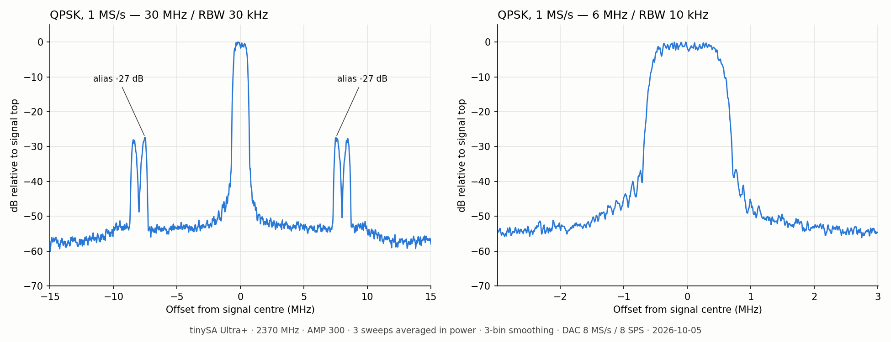</a></td>
    <td width="50%" align="center"><strong>500 kS/s</strong><br><a href="docs/spectrum_500kBd.png">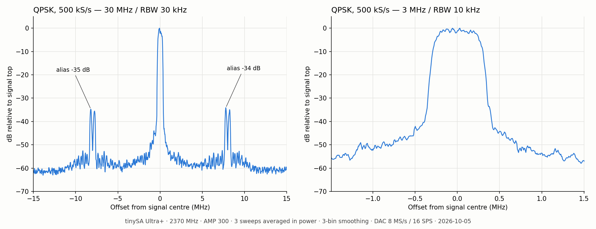</a></td>
  </tr>
  <tr>
    <td width="50%" align="center"><strong>333 kS/s</strong><br><a href="docs/spectrum_333kBd.png">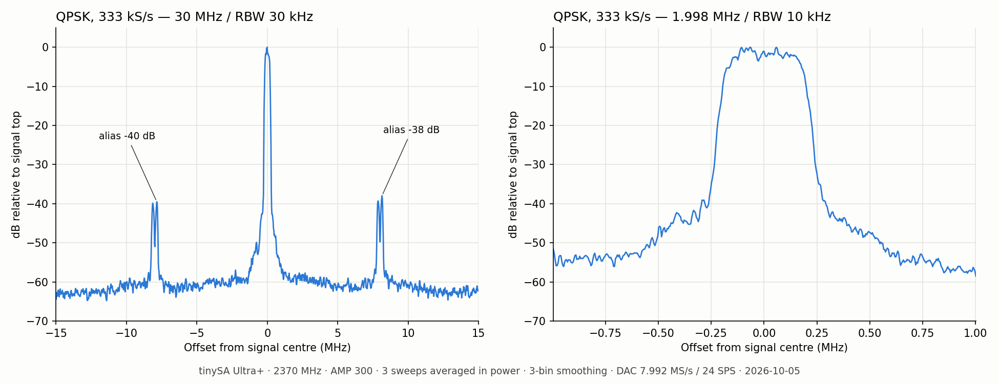</a></td>
    <td width="50%" align="center"><strong>250 kS/s</strong><br><a href="docs/spectrum_250kBd.png">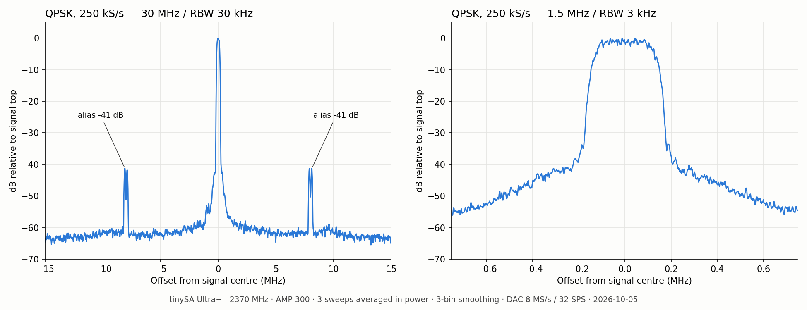</a></td>
  </tr>
  <tr>
    <td width="50%" align="center"><strong>125 kS/s</strong><br><a href="docs/spectrum_125kBd.png">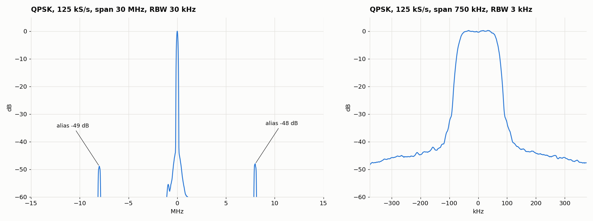</a></td>
    <td width="50%" align="center"><strong>66 kS/s</strong><br><a href="docs/spectrum_66kBd.png">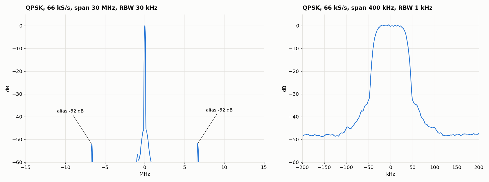</a></td>
  </tr>
  <tr>
    <td width="50%" align="center"><strong>33 kS/s</strong><br><a href="docs/spectrum_33kBd.png">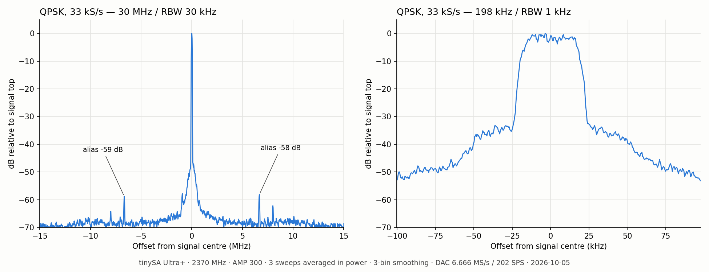</a></td>
    <td width="50%"></td>
  </tr>
</table>

### 8PSK — 33 to 1000 kS/s

<table>
  <tr>
    <td width="50%" align="center"><strong>1 MS/s</strong><br><a href="docs/spectrum_8PSK_1MBd.png">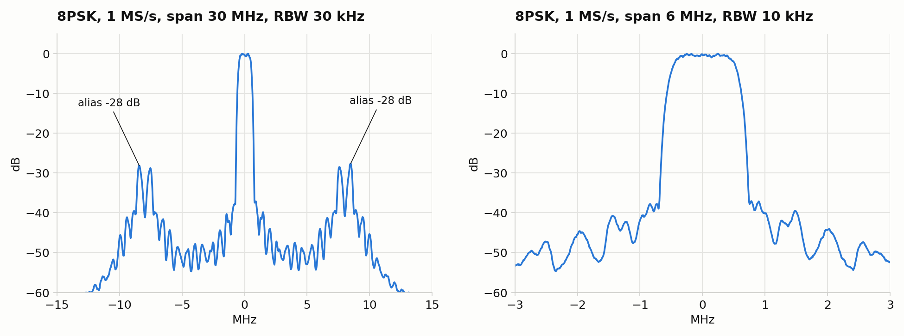</a></td>
    <td width="50%" align="center"><strong>500 kS/s</strong><br><a href="docs/spectrum_8PSK_500kBd.png">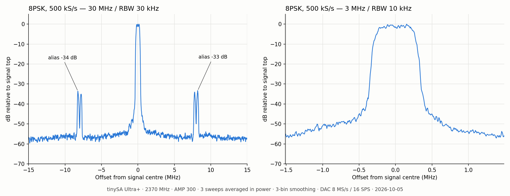</a></td>
  </tr>
  <tr>
    <td width="50%" align="center"><strong>333 kS/s</strong><br><a href="docs/spectrum_8PSK_333kBd.png">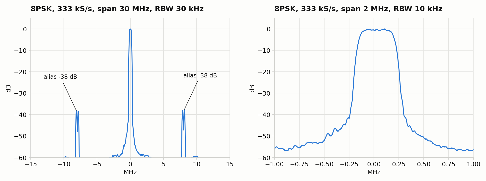</a></td>
    <td width="50%" align="center"><strong>250 kS/s</strong><br><a href="docs/spectrum_8PSK_250kBd.png">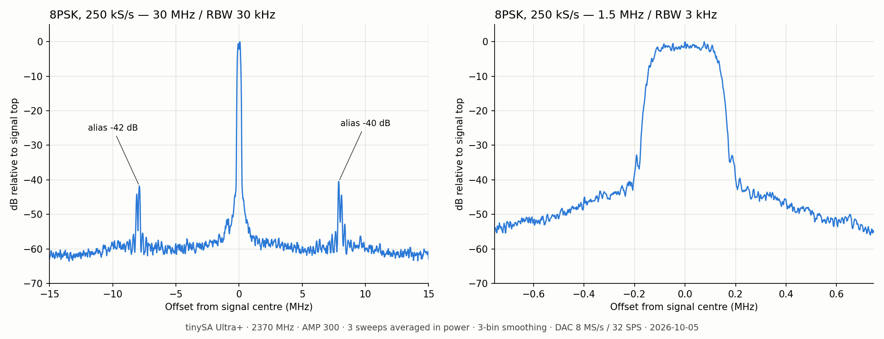</a></td>
  </tr>
  <tr>
    <td width="50%" align="center"><strong>125 kS/s</strong><br><a href="docs/spectrum_8PSK_125kBd.png">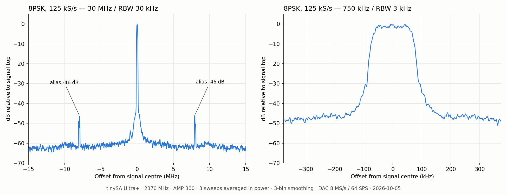</a></td>
    <td width="50%" align="center"><strong>66 kS/s</strong><br><a href="docs/spectrum_8PSK_66kBd.png">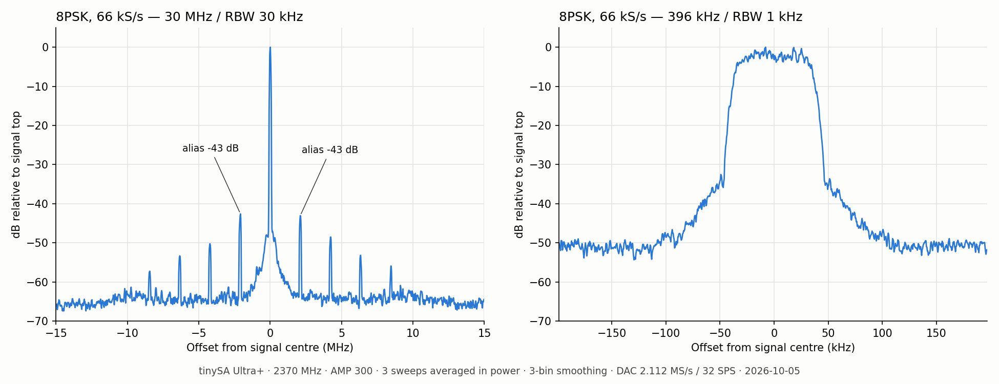</a></td>
  </tr>
  <tr>
    <td width="50%" align="center"><strong>33 kS/s</strong><br><a href="docs/spectrum_8PSK_33kBd.png">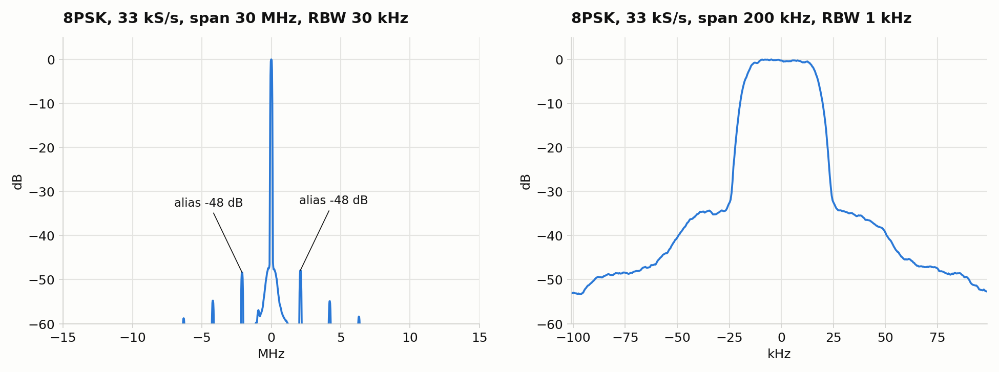</a></td>
    <td width="50%"></td>
  </tr>
</table>

### 16APSK — 33 to 500 kS/s

<table>
  <tr>
    <td width="50%" align="center"><strong>500 kS/s</strong><br><a href="docs/spectrum_16APSK_500kBd.png">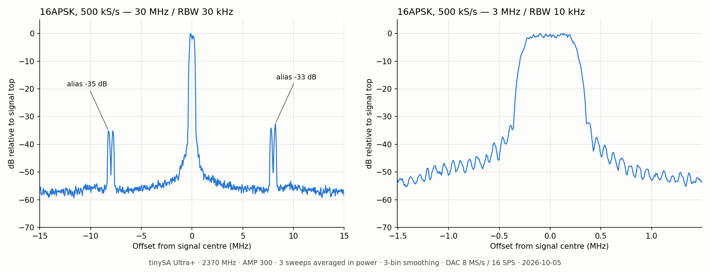</a></td>
    <td width="50%" align="center"><strong>333 kS/s</strong><br><a href="docs/spectrum_16APSK_333kBd.png">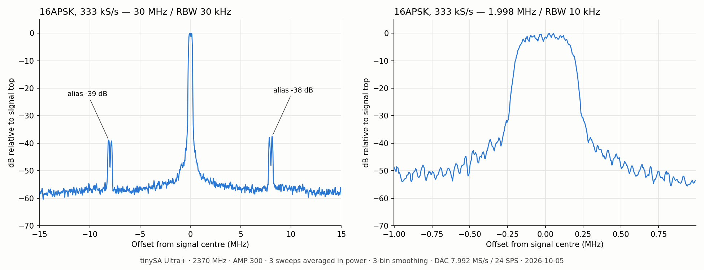</a></td>
  </tr>
  <tr>
    <td width="50%" align="center"><strong>250 kS/s</strong><br><a href="docs/spectrum_16APSK_250kBd.png">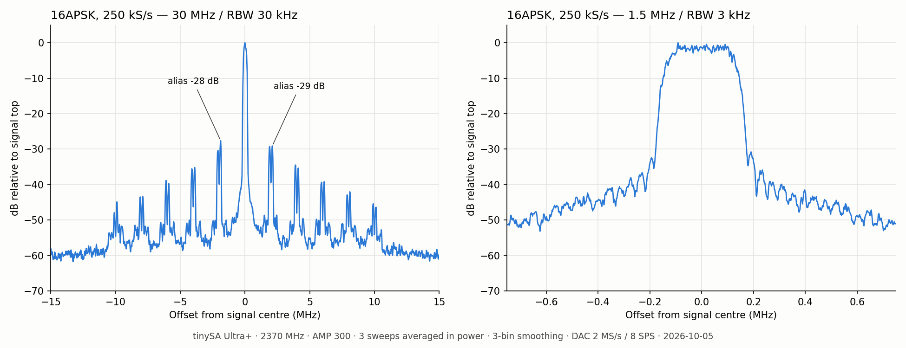</a></td>
    <td width="50%" align="center"><strong>125 kS/s</strong><br><a href="docs/spectrum_16APSK_125kBd.png">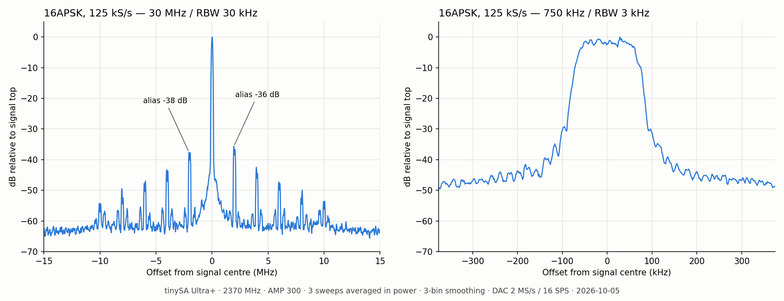</a></td>
  </tr>
  <tr>
    <td width="50%" align="center"><strong>66 kS/s</strong><br><a href="docs/spectrum_16APSK_66kBd.png">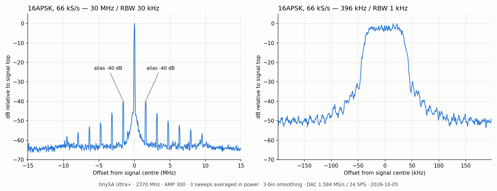</a></td>
    <td width="50%" align="center"><strong>33 kS/s</strong><br><a href="docs/spectrum_16APSK_33kBd.png">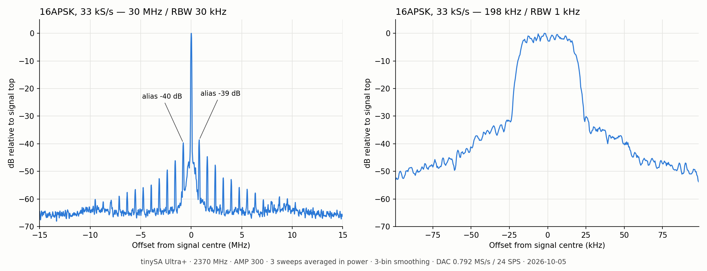</a></td>
  </tr>
</table>

### Amplitude sweep — 8PSK and 16APSK at 500 kS/s

Separate amplitude measurement. Above about `--amp 430`, the output compresses and
out-of-band emissions increase.

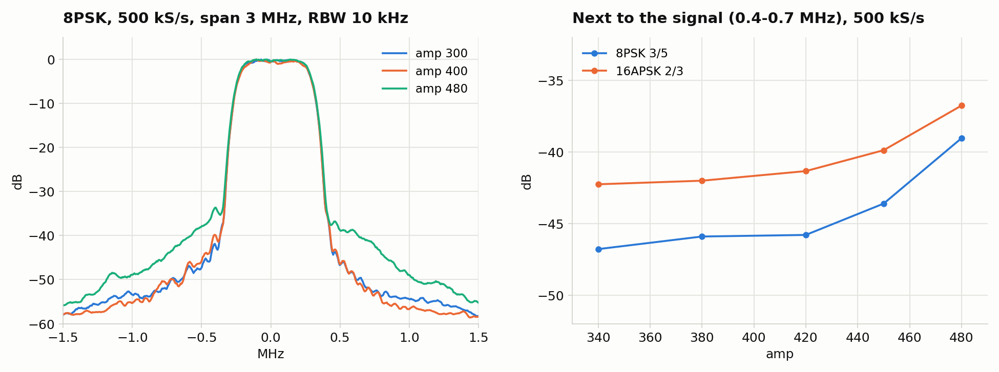

## License

[PolyForm Noncommercial 1.0.0](LICENSE). Copyright (c) 2026 SP8ESA.
The Sintel trailer is by the Blender Foundation, [CC BY 3.0](media/README.md).
