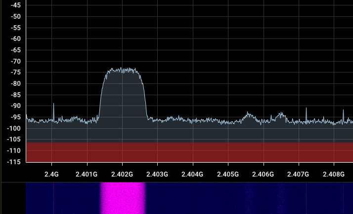
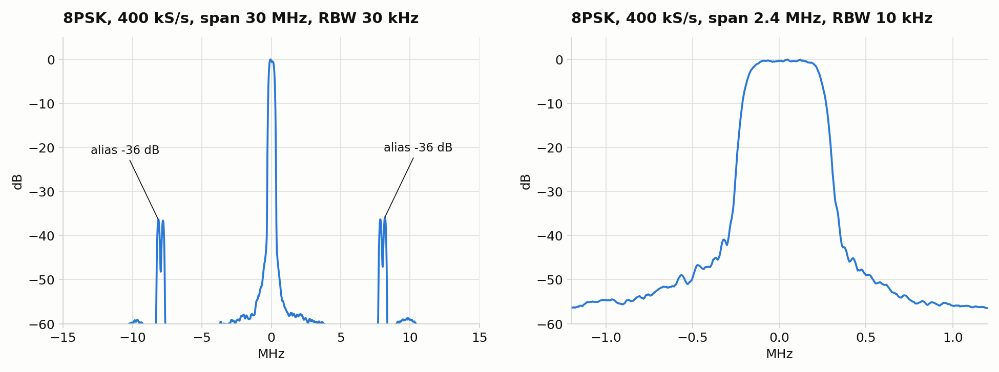
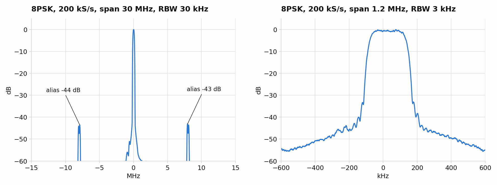

<p align="center"></p>

# ESP32-DATV

**A DVB-S and DVB-S2 digital amateur TV transmitter in a bare ESP32-C3: QPSK from 1 Msymbol/s down to 33 ksymbol/s (DVB-S2 also 8PSK, about 10 to 500 ksymbol/s and 1 Msymbol/s, and 16APSK, 333 to 500 ksymbol/s) in the 13 cm band, no RF hardware added.**



*The 1 MBd DVB-S signal around 2402 MHz, seen in SDR++ on a HackRF One (the author's screenshot, taken with the earlier
4 MS/s output). The faint humps a few MHz to the right are the images of that 4 MS/s zero-order-hold output. The firmware now
updates the DAC at 8 MS/s (6.67 MS/s for the lowest rates): the images moved from +-4 MHz out to +-8 MHz and the strongest
one is about 6 dB lower, and much lower still at the narrower symbol rates (see [Spectra](#spectra)).*

The ESP32-C3's Wi-Fi transmitter has an I/Q modulator and a 10-bit I/Q DAC feeding it. This project drives that DAC directly
from the CPU at 8 mega-samples per second (6.67 MS/s for the two lowest symbol rates), so the chip itself produces a
root-raised-cosine QPSK (or, for DVB-S2, 8PSK or 16APSK) signal on 2.4 GHz. A PC
encodes an MPEG transport stream to DVB-S (energy dispersal, Reed-Solomon, interleaver, convolutional code) or to DVB-S2 QPSK, 8PSK or 16APSK (BBFRAME,
BCH, LDPC, physical layer framing, optional pilots) and streams the symbols over USB; the ESP does the pulse shaping and the output.
The demo film in `media/` plays on a normal DVB-S receiver.

**For licensed radio amateurs only.** See [Legal](#legal-and-safety) before you transmit anything.

## What is in the box

| Path | What |
|---|---|
| `firmware/` | ESP-IDF project, transmit only (`main/main.c`, `main/qpsk_lut.h`, `main/lut8.S`, `main/lutg.S`, `main/lutg_psk8.S`, `main/lutg_p8s8.S`, `main/lutg_a16.S`) |
| `firmware/tools/gen_lut8.py` | Generates `main/lut8.S`, the hand-scheduled 8 MS/s loop for 1 MBd, from `lut8_pads.json` (per-slot padding) |
| `firmware/tools/gen_lutg.py` | Generates `main/lutg.S`, the hand-scheduled loop for all the other rates (any samples per symbol, 8 or 6.67 MS/s), from `lutg_pads.json` |
| `firmware/tools/lutg_tune.py` | Tunes the padding of the generated loops with the timing build (`gen_lutg.py --rec timing`); `gen_lutg.py --psk8` generates `main/lutg_psk8.S`, the 8PSK variant, from `lutg_psk8_pads.json` |
| `firmware/tools/gen_lutg_p8s8.py`, `lutg_tune_p8s8.py` | Generate `main/lutg_p8s8.S`, the 8PSK loop for 1 MBd (own generator: 8 samples per symbol, a pass of 8 symbols, 3 bit symbols), from `lutg_p8s8_pads.json`, and tune its padding with the timing build |
| `firmware/tools/gen_lutg_a16.py` | Generates `main/lutg_a16.S`, the 16APSK loop (any 16 to 24 samples per symbol at 8 MS/s, RRC span 6, 4 bit symbols), from `lutg_a16_pads.json`; `lutg_tune.py --a16` tunes its padding |
| `host/dvbs.py` | DVB-S encoder, TS to QPSK symbols (EN 300 421, all code rates 1/2 ... 7/8), with a self-test |
| `host/dvbs2.py`, `host/dvbs2_ldpc.json` | DVB-S2 encoder, TS to QPSK, 8PSK and 16APSK symbols (EN 302 307: normal and short frames, all QPSK, 8PSK and 16APSK code rates, pilots), with a self-test; the LDPC tables of the standard |
| `host/dvbs2_vs_gnuradio.py` | Compares the DVB-S2 encoder with GNU Radio's gr-dtv stage by stage (development only) |
| `host/tx_dvbs.py` | The transmitter script: transport stream source (demo film, any video, test pattern, stdin) or an unmodulated carrier, DVB-S or DVB-S2 encoder, USB streaming |
| `host/tx_qpsk_test.py` | Random-symbol QPSK test for looking at the spectrum |
| `host/esp_link.py` | USB link to the firmware |
| `host/test_lut.c` | Checks the firmware's lookup tables against a direct floating-point RRC filter, on the PC |
| `host/test_lutg_words.c`, `host/lutg_record.py` | Check the DAC words the generic assembly loop really produces against the reference model (recording build) |
| `host/cal.json` | Example DC / I-Q trim (measured on the author's board) |
| `docs/` | Pictures for this README, including the measured spectra of all symbol rates |
| `media/` | The demo film (Sintel trailer, CC BY 3.0) |

## Quick start

You need an ESP32-C3 board with the native USB port (USB Serial/JTAG, shows up as `/dev/ttyACM0`; any DevKit or SuperMini
will do), ESP-IDF, Python 3 with `numpy` and `pyserial`, and `ffmpeg`.

```sh
# 1. firmware (tested with ESP-IDF 6.2.0)
cd firmware
idf.py set-target esp32c3
idf.py build flash

# 2. transmit the demo film in a loop on 2402.000 MHz, 1 MBd, FEC 1/2
cd ../host
pip install -r requirements.txt
python3 tx_dvbs.py --freq 2402.000
```

Tune a DVB-S receiver to the centre frequency printed by the script, **symbol rate 1000 kS/s, FEC 1/2** (or auto), roll-off
0.35 (for another `--baud`, the symbol rate the script prints). If it does not lock, try `--invert` or `--swap-iq`. Stop with
Ctrl-C; the ESP also switches itself off 0.5 s after the PC goes quiet.

Symbol rates. The DAC is updated every 20 CPU cycles (8 MS/s) or 24 cycles (6.67 MS/s); the script picks the number of samples per
symbol (`--sps` overrides it):

| `--baud` | samples per symbol | cycles per DAC store | DAC rate | actual symbol rate |
|---|---|---|---|---|
| 1 000 000 | 8 | 20 | 8 MS/s | 1 000 000 (`lut8.S`) |
| 500 000 | 16 | 20 | 8 MS/s | 500 000 |
| 333 000 | 24 | 20 | 8 MS/s | 333 333 (+0.10 %) |
| 250 000 | 32 | 20 | 8 MS/s | 250 000 |
| 125 000 | 64 | 20 | 8 MS/s | 125 000 |
| 66 000 | 101 | 24 | 6.67 MS/s | 66 007 (+0.01 %) |
| 33 000 | 202 | 24 | 6.67 MS/s | 33 003 (+0.01 %) |

Any other `--baud` that gives 16..232 samples per symbol within 1 % of the requested rate at one of the two periods (100 000 Bd = 80
samples at 20 cycles, say) uses the same loop; the rest runs on the C loops at up to 4 MS/s. The script prints the actual symbol rate.

Other sources:

```sh
python3 tx_dvbs.py --film my_video.mp4                  # any video; ffmpeg encodes it to fit the channel (H.264 + MP2)
python3 tx_dvbs.py --test                               # ffmpeg test pattern
python3 tx_dvbs.py --null                               # empty multiplex: the receiver should lock but show nothing
python3 tx_dvbs.py --cw                                 # no DVB-S: an unmodulated carrier on the centre frequency (tuning, level checks)
ffmpeg -re -i in.mp4 ... -f mpegts -muxrate 880000 - | python3 tx_dvbs.py --ts -       # your own transport stream
python3 tx_qpsk_test.py --seconds 60                    # plain random QPSK, for spectrum checks
```

Useful options: `--baud` (2000 ... 1000000, e.g. 33000 for narrow-band DATV: picture size, frame rate and audio shrink with
the channel), `--fec 1/2|2/3|3/4|5/6|7/8`, `--amp` (peak DAC code, default 300 for QPSK and 420 for 8PSK and 16APSK, max 480; above
about 430 the output compresses, see [Amplitude](#amplitude)), `--ifm N` (centre = LO + N x baud, moves the LO leakage out of the signal), `--sps` (samples per
symbol, normally chosen for you), `--cw` (carrier only), `--ppm`.

**Set `--ppm` for your board.** The PLL assumes an exact 40 MHz crystal, and real crystals are off by some ppm (about +12 ppm
on the author's board, which is 29 kHz at 2.4 GHz). The crystal also drifts several ppm while the chip warms up (about
250 Hz/s over the first minutes, 10 ppm in total on the author's board), so use a receiver with AFC; normal DATV receivers have it.

### DVB-S2

```sh
python3 tx_dvbs.py --freq 2402.000 --baud 500000 --dvbs2 --fec 2/3                       # DVB-S2, QPSK 2/3, normal frames
python3 tx_dvbs.py --freq 2402.000 --baud 125000 --dvbs2 --fec 3/4 --frame short --pilots
python3 tx_dvbs.py --freq 2402.000 --baud 400000 --dvbs2 --mod 8psk --fec 2/3             # DVB-S2, 8PSK 2/3
python3 tx_dvbs.py --freq 2402.000 --baud 1000000 --dvbs2 --mod 8psk --fec 3/5            # DVB-S2, 8PSK at 1 MBd
python3 tx_dvbs.py --freq 2402.000 --baud 33000 --dvbs2 --mod 8psk --fec 2/3 --frame short # narrowband 8PSK (actual 32 895 Bd)
python3 tx_dvbs.py --freq 2402.000 --baud 500000 --dvbs2 --mod 16apsk --fec 2/3            # DVB-S2, 16APSK 2/3
```

DVB-S2: the receiver needs the same symbol rate, the modulation (QPSK, 8PSK or 16APSK), the code rate, roll-off 0.35 (it is signalled in the stream), and the
frame size and pilots are detected from the physical layer header. Normal frames are 64800 bits, short frames 16200 bits (shorter
latency at narrow symbol rates: a normal frame is 1 s long at 33 kBd, a short one 0.25 s); pilots are 36 symbols after every 16
slots, they cost 2.2-2.4 % of the rate and help a receiver to track the carrier. Useful transport stream rate at 1 MBd, no pilots (it scales with
the symbol rate; pilots lower it by 2.2-2.4 %):

| code rate | normal frame | short frame |
|---|---|---|
| 1/4 | 490 kb/s | 365 kb/s |
| 1/3 | 656 kb/s | 629 kb/s |
| 2/5 | 789 kb/s | 761 kb/s |
| 1/2 | 989 kb/s | 849 kb/s |
| 3/5 | 1188 kb/s | 1157 kb/s |
| 2/3 | 1322 kb/s | 1288 kb/s |
| 3/4 | 1487 kb/s | 1420 kb/s |
| 4/5 | 1587 kb/s | 1508 kb/s |
| 5/6 | 1655 kb/s | 1596 kb/s |
| 8/9 | 1766 kb/s | 1728 kb/s |
| 9/10 | 1789 kb/s | - |

**8PSK** (`--mod 8psk`): code rates 3/5, 2/3, 3/4, 5/6, 8/9 and 9/10 (short frames: no 9/10), symbol rates 125 to 500 kBd (8 MS/s with 16 to 64
samples per symbol; `--baud 500000`, `400000`, `333333`, `250000`, `200000`, `125000` are the usual ones) and 1 MBd (8 samples per symbol, its own loop).
Lower rates, down to about 10 kBd, use a C loop with a slower DAC so that the RRC tables fit in RAM. The script chooses the samples per symbol and prints
the actual rate; set the receiver to that rate. Short frames reduce latency at narrow rates. The lower-rate streaming path has host-side regression tests.
Hardware reception at 66 kBd (actual 66 115.7 Bd), 8PSK 2/3, short frames, recovered a continuous run of 197 BBFRAMEs from a 20-second HackRF recording:
1380 transport packets passed their CRC-8 checks, with no continuity errors, and the exported video and audio decoded without errors. SDRangel reception
was also confirmed at 66 kBd and 1 MBd. The spectrum measurements below cover 8PSK from 33 kBd to 1 MBd.

| requested 8PSK rate | samples per symbol | CPU cycles per DAC store | DAC update rate | actual symbol rate |
|---|---|---|---|---|
| 125 000 Bd | 64 | 20 | 8 MS/s | 125 000 Bd |
| 66 000 Bd | 44 | 55 | 2.909 MS/s | 66 116 Bd |
| 33 000 Bd | 64 | 76 | 2.105 MS/s | 32 895 Bd |

Useful transport stream rate at 400 kBd, no pilots (multiply by 2.5 for 1 MBd: 3/5 1780 kb/s, 2/3 1981, 3/4 2228, 5/6 2479, 8/9 2646, 9/10 2679 kb/s in normal frames):

| code rate | normal frame | short frame |
|---|---|---|
| 3/5 | 712 kb/s | 690 kb/s |
| 2/3 | 792 kb/s | 769 kb/s |
| 3/4 | 891 kb/s | 848 kb/s |
| 5/6 | 991 kb/s | 952 kb/s |
| 8/9 | 1058 kb/s | 1031 kb/s |
| 9/10 | 1072 kb/s | - |

The PC sends 8PSK and 16APSK as two symbols per byte (one nibble each), i.e. 250 kB/s at 500 kBd. The ESP reads one USB byte per symbol, and the
USB link carries (64 byte packets, the chip's FIFO is drained byte by byte by the CPU) about 262 kB/s at that read rate: 500 kBd is the edge. With the
host encoding ahead of the writes (below) the ESP's buffer held its level for 16APSK at 500 kBd, and at 444 kBd and below the margin grows (the reads come
less often but the link needs less). `tx_dvbs.py` notes the edge for 8PSK above 420 kBd. At 1 MBd the symbols travel as a bit stream, 3 bits each (375 kB/s; the nibbles would
need 500 kB/s), and the link has to be kept busy: the Linux USB serial driver takes about one write at a time, so a loop that encodes and writes
alternately delivered 360 kB/s and the ESP ran dry 6 % of the time; `tx_dvbs.py` encodes in its own thread, ahead of the writes, and the link then
carries 420-430 kB/s (the ring stays at its target of 6000 pairs). 16APSK and 32APSK are not possible (the loop looks up two symbols at a time and
those constellations have too many points). The picture size, frame rate and audio of the demo stream follow the channel capacity as in DVB-S.

**16APSK** (`--mod 16apsk`): code rates 2/3, 3/4, 4/5, 5/6, 8/9 and 9/10 (short frames: no 9/10), 333 to 500 kBd (8 MS/s with 16 to 24 samples per symbol;
`--baud 500000`, `444444`, `400000`, `333333`). Useful transport stream rate at 500 kBd, no pilots (scales with the symbol rate):

| code rate | normal frame | short frame |
|---|---|---|
| 2/3 | 1319 kb/s | 1274 kb/s |
| 3/4 | 1483 kb/s | 1405 kb/s |
| 4/5 | 1583 kb/s | 1492 kb/s |
| 5/6 | 1650 kb/s | 1579 kb/s |
| 8/9 | 1762 kb/s | 1709 kb/s |
| 9/10 | 1784 kb/s | - |

The two rings (4 + 12 points) have a radius ratio that depends on the code rate (2.57 to 3.15, the standard's table); the receiver needs the modulation
and the code rate, nothing else. A 16APSK receiver needs a better signal than for 8PSK: the standard's thresholds are Es/N0 9 dB (2/3) to 13 dB (9/10) with an ideal
receiver, and a real one needs several dB more (SDRangel's DATV demodulator needed its soft LDPC option for 8PSK 3/5 at MER 12 dB). The default
amplitude is `--amp 420` (the tables are scaled to the worst case, so the lower mean power of the higher order modulations leaves room above QPSK's 300; more
than about 430 only compresses the output, see [Amplitude](#amplitude)); the rest has to come from the receive level: MER above 15 dB. The RRC filter of the 16APSK loop is truncated to 6 symbols (the tables of
256 rows per group of two symbols would take 80 KB with 8): the first sidelobe region is about 4 dB higher than with 8 symbols (-31 dB instead of -35 dB per bin
relative to the signal) and the far skirt about 10 dB. The header and the pilots of the PL frame have radius 1 in the standard; the alphabet of the loop is the 16
points, so they are sent as the outer ring points at the same angles (radius 1.11 to 1.14), which the receivers tried here do not notice.

## How it works

* **The DAC.** The RF block has a replay engine that plays RAM at 0x3FCB0000 into the I/Q DAC at 40 MS/s (the
  `dactrig` of Espressif's RF test library). Running it as a loop of **one** word makes it a held 10-bit I/Q register that the
  CPU updates with a plain store (I in bits 9:0, Q in bits 19:10). Longer rings cannot be written live (the CPU access to the
  bank is garbled while it plays); a one-word loop works because the DMA pointer never moves.
* **Pulse shaping with tables.** With an integer number of samples per symbol the RRC filter output depends only
  on the last few symbols and the phase inside the symbol, so tables hold ready DAC words (I field + Q field): one sample is a few
  loads, adds, an xor and a store. The C loops (rates without a fast loop) use three tables of 256 rows (4 symbols of I and Q each,
  RRC span 12) and need about 14 of the 40 cycles available at 1 MBd and 4 MS/s; the two assembly loops below trade the span for a
  higher DAC rate (span 8). An IF that is a whole multiple of the symbol rate is baked into the tables for free, and so are the
  DC and I/Q-imbalance trims. `host/test_lut.c` checks the tables (error under 1.5 DAC codes, SNR about 50 dB).
* **8 MS/s at 1 MBd** (`main/lut8.S`). 8 samples per symbol leave 20 CPU cycles per sample, too few for compiled code: the
  loop is hand-scheduled RISC-V assembly in which every slot (store, next word, a share of the symbol's work, padding) takes
  exactly 20 cycles, measured with a timing build that records every store. One cycle-counter sync per symbol (a jump into a
  `nop` sled) absorbs what cannot be made exact: access to the USB peripheral crosses into its 48 MHz clock domain and varies
  by a cycle. RRC span 8 symbols there (2 tables), the fill report runs in a balanced maintenance pass every 2 ms. Measured
  instruction costs on this core: cycle counter read 1, USB register read 6, USB register write 8, DAC store 1, RAM load 1 (+1 when the next
  instruction uses it), taken branch 3.
* **Every other symbol rate at 8 / 6.67 MS/s** (`main/lutg.S`, generated by `tools/gen_lutg.py`). The same method for any samples per
  symbol S from 16 to 232, chosen at run time. The RRC span is 8 symbols, from four tables of two symbols (16 rows each) laid out so that
  the next sample of a row is 64 bytes further: a sample is four loads, three adds, an xor and a store, and the loop just adds 64 to the
  four row pointers. A symbol is S slots of exactly 20 (or 24) cycles: 13 unrolled slots carry the per-symbol work (the next symbol out
  of the ring, the row pointers, one USB byte), a one-slot loop of 18 cycles produces the other samples, and the last two slots read
  the cycle counter, compare it with the absolute symbol schedule and jump into a 24-`nop` sled in front of the next symbol's code, which
  absorbs whatever deviates, so the symbol rate is exact and no slot but that one has a variable length. There are four copies of the
  symbol code: normal, and three maintenance symbols after each other every 2048 symbols (silence check, fill report written to the
  USB FIFO). The timing was tuned with a recording build that stamps the cycle counter after every DAC store (the stores are spaced
  exactly 20 or 24 cycles apart, apart from a cycle where a slot touches the USB registers), and the DAC words it produces were compared
  with the reference model on the PC (`host/test_lutg_words.c`). Tables take 256 x S bytes (52 KB at 33 kBd).
* **8PSK** (`main/lutg_psk8.S`, `gen_lutg.py --psk8`, `PSK8T` command). The same loop structure at 8 MS/s with 16 to 64 samples per symbol,
  but the four tables of two symbols now have 64 rows each (3 + 3 bits of history, index x 4 bytes, the next sample of a row 256 bytes further),
  so the tables take 1024 x S bytes (40 KB at 200 kBd). A symbol is the angle index 0..7 (point k = e^(j pi k / 4)), two to a ring byte, low nibble
  first. The loop was developed as in `lutg.S`: a timing build and a recording build (`host/lutg_record.py`, `gen_lutg.py --rec timing|words`),
  `firmware/tools/lutg_tune.py` to tune the padding. The DAC words it produces match the reference model on the PC for 16, 24, 32 and 40 samples
  per symbol (0 mismatches). Timing: the three maintenance copies are exact (every store 20 cycles after the previous one), the normal copy
  has two pairs of slots (7/8 and 11/12) that run 21 and 19 cycles: one USB register access in them lands on a 48 MHz clock edge so that no
  amount of padding gives exactly 20; the pair adds up to 40, so the stream is on the grid again after it, and the symbol rate is exact as before.
* **Narrowband 8PSK** (`tx_p8_c` in `main/main.c`). The same span-8 RRC tables and nibble-packed symbols, with 16 to 64 samples per symbol at a DAC store
  every 55 or more CPU cycles. Every 2048 symbols the loop reports the ring fill to the host: checking the transmit FIFO, writing the four report bytes,
  flushing and checking for host silence are spread across separate sample slots. The encoder thread retains a prepared block while its queue is full,
  preserving the coded stream when USB writes pause.
* **8PSK at 1 MBd** (`main/lutg_p8s8.S`, `tools/gen_lutg_p8s8.py`, `PSK8T ... 1000000 8`). The generic loop needs 16 or more slots per symbol for
  its per-symbol work, so 1 MBd has its own loop with no inner loop at all: a pass is 8 symbols = 64 slots of 20 cycles, fully unrolled, with a
  sync (measure, jump into a nop sled) every two symbols. The four 2-symbol tables are 8 KB; their row pointers are biased by 1024 bytes so that the
  eight samples of a symbol are reached with immediates from -1024 to +768. The symbols arrive as a bit stream (symbol i in bits 3i .. 3i+2, low
  bits first, 8 symbols = 3 bytes), taken from a bit window in a register into which the next record is merged byte by byte, so a symbol costs four
  instructions. The USB FIFO is read once per symbol. There are two code copies, N and M (maintenance: silence check, fill report, underruns, flush,
  one pass in 257), 5 KB each; the IRAM is short, so the padding nops are 2 byte `c.nop`s, and `CONFIG_HEAP_PLACE_FUNCTION_INTO_FLASH` keeps the heap below
  the RF dump bank big enough for the 16 KB symbol ring (without it the 33 kBd mode ran out of memory). Timing was tuned with the recording build
  (`tools/lutg_tune_p8s8.py`, a fixed start phase of the loop against the 48 MHz USB clock): every store is 20 cycles after the previous one, a few
  USB slots 19 (never 21), the sync never late, and the DAC words match the reference model on the PC (`host/test_lutg_words.c -p8s8`, 0 mismatches,
  all slots of both copies).
* **16APSK** (`main/lutg_a16.S`, `tools/gen_lutg_a16.py`, `A16T` command). The structure of the generic loop (unrolled slots, a 1-slot loop, the measuring slot, a
  sync sled, four code copies) with 4 bit symbols (one nibble of the ring, point index v = 0..15 of the DVB-S2 mapping) and an RRC filter truncated to 6
  symbols = three tables of 256 rows (two symbols of 4 bits each), so the tables take 3072 x S bytes (48 KB at 500 kBd, 74 KB at 333 kBd, the most the heap
  holds). A table is stored row by row, the row pointer is base + index x 4 x S (one `mul`), and the next sample of a row is 4 bytes further, so the immediates of the
  unrolled slots stay small. The ring is 8 KB (the ESP allocates the tables first, then the ring that the mode needs, on every run). The
  RAM is the limit of this mode: the heap functions live in flash (`CONFIG_HEAP_PLACE_FUNCTION_INTO_FLASH`) and the Wi-Fi buffer pools are at their minimum (`sdkconfig.defaults`:
  the Wi-Fi only brings up the PHY), which leaves 86 KB in the biggest block of the heap for the tables (74 KB at 333 kBd) and the ring. The command takes a last argument, gamma x 100 (the ring ratio of the code rate), for the
  tables. The DAC words match the reference model (`host/test_lutg_words.c -a16`) at 16, 20 and 24 samples per symbol with no mismatch; the padding was tuned with
  the recording build (`lutg_tune.py --a16`): the slots are 20 cycles apart, apart from a pair of USB slots at 21 and 19 in the normal copy.
* **Scheduling (C loops).** Two symbols per loop pass, with the per-symbol work (decode, table row pointers, USB read, ring refill)
  spread over the slots so that no sample slot overruns its period. USB (a 64-byte FIFO, each register read costs ~12
  cycles from compiled code) is touched at most once per slot.
* **USB protocol.** Text command `QPSKT f_MHz baud sps [amp [seconds [ifm [target [dcI dcQ [g phi]]]]]]`, then a **raw
  symbol stream**, 4 symbols per byte (bit 0 = I level, bit 1 = Q level, 1 = +1, first symbol in the low bits), no framing.
  `PSK8T` takes the same arguments but 2 symbols per byte (low nibble first, value 0..7 = angle index); at 1 MBd (8 samples per symbol) 3 bits per
  symbol, a bit stream (8 symbols = 3 bytes). `A16T` takes the same arguments plus gamma x 100 (R2 / R1 of the 16APSK rings), 2 symbols per byte (one nibble: the point index).
  `target` = 0 makes the ESP generate random symbols itself (not in the 8 / 6.67 MS/s loops). The ESP returns 4-byte fill reports (`B7`, fill lo/hi, underruns)
  every 256 pairs; the PC keeps the ring about 3000 pairs (about 24 ms) full. A silent host for 0.5 s switches the
  transmitter off.
* **DVB-S2 on the PC** (`host/dvbs2.py`): the transport stream becomes user packets with the CRC-8 of the previous packet in the place
  of the sync byte, cut into BBFRAMEs (10 byte header with SYNCD), BB scrambler, BCH (the generator polynomial is built from the
  minimal polynomials of the field, t = 12, 10 or 8), LDPC (irregular repeat-accumulate, the parity address tables of the standard in
  `dvbs2_ldpc.json`), QPSK mapping, the PLHEADER (start of frame word + PLSCODE through the (64,7) code, pi/2 BPSK), pilots and the
  physical layer scrambler (Gold code 0). For QPSK every symbol is one of four points, so the stream is the same two bits per
  symbol as for DVB-S and the ESP firmware did not change; for 8PSK (bit interleaver with 3 columns, the constellation of the standard) the symbol
  stream is packed as angle indices and needs `PSK8T` and `lutg_psk8.S`. A frame is not a whole number of bytes, so the encoder carries up to three
  symbols over to the next frame.
* **DVB-S on the PC** (`host/dvbs.py`): scrambler (1+x^14+x^15, restarted every 8 packets), RS(204,188), Forney interleaver
  (I=12), K=7 convolutional code (171, 133 octal) with puncturing, QPSK Gray mapping. Null packets pad the stream whenever
  the source is slower than the channel.

## Measured

Everything below is on one board (ESP32-C3 rev 0.4, 40 MHz crystal), with a HackRF One a short distance away.

* The signal decoded with **leandvb**, an independent DVB-S decoder, bit for bit, in simulation for every code rate and over
  the air at 1 MBd, FEC 1/2: 6003 transport stream packets in 10 s with no residual errors, H.264 640x360 video and audio
  intact. leandvb reported MER 16-18 dB. With the 8 / 6.67 MS/s loops at 1 MBd, 500, 333, 250, 66 and 33 kBd it locked with VBER 0
  and MER 20-26 dB; at 125 kBd a 10 s capture decoded offline to 705 transport stream packets and 79 video frames.
* 1 MBd, 4 MS/s (C loop) against 8 MS/s (assembly loop), random symbols, same setup; level per bin relative to the level in
  the signal band, both sides averaged, measurement floor about -47 dB:

  | offset from centre | 4 MS/s | 8 MS/s |
  |---|---|---|
  | 1.0-1.5 MHz | -33.3 dB | -36.4 dB |
  | 2.0-2.5 MHz | -35.2 dB | -39.4 dB |
  | 2.5-3.0 MHz | -35.5 dB | -41.2 dB |
  | 3.5-4.0 MHz (images of 4 MS/s) | -24.4 dB | -43.4 dB |
  | 7.5-8.0 MHz (images of 8 MS/s) | -32.5 dB | -31.3 dB |

  DVB-S decode in the same conditions: 4 MS/s 6082 packets in 10 s, MER 17.1 dB; 8 MS/s 6062 packets, MER 16.7 dB.
* **DVB-S2** verified three ways. (1) Against GNU Radio's gr-dtv transmitter: BBFRAME, BB scrambler, BCH, LDPC, QPSK mapping and the
  whole PLFRAME match bit for bit in all 42 modes (normal and short frames, every code rate, pilots on and off). (2) Through an
  independent receiver, SatDump (PL synchronisation, LDPC, BCH, descrambler), on simulated baseband of the same 42 modes: the BBFRAMEs
  it returns are identical to the transmitted ones (all but the first, which is lost while it synchronises). (3) Over the air, ESP
  to HackRF to SatDump, with a transport stream of numbered packets of known content: 1 MBd 1/2 and 8/9 (pilots), 500 kBd 1/2, 2/3
  (pilots) and 9/10 (pilots), 250 kBd 1/4 and short 5/6, 125 kBd short 3/4, 66 kBd 1/2 and 33 kBd normal 1/2 and short 1/2 (pilots):
  every packet that came out of a valid frame was exact (about twenty thousand packets, none wrong), and an H.264 video decoded. A
  receiver needs a moment to lock: in the 500 kBd 2/3 recording the first 12 frames were partly lost, the next 53 were all good.
* **DVB-S2 8PSK.** (1) Against gr-dtv: BBFRAME, scrambler, BCH, LDPC, bit interleaver, 8PSK mapping and the whole PLFRAME (header, pilots,
  scrambler) match bit for bit in the 8PSK modes tried (normal and short frames, 3/5, 2/3, 5/6, 8/9 and 9/10, pilots on and off). (2) SatDump on simulated
  baseband (RRC 0.35, 24 dB Es/N0, 4 samples per symbol) of normal frames at every 8PSK code rate and of short frames at 3/5, 2/3 and 8/9: every transport
  stream packet it returned was exact (1700 to 2800 packets per normal frame run). (3) The loop on the chip: the DAC words recorded from the
  firmware agree with the reference model, and the tables with a floating-point RRC filter (SNR 47.6 dB, 47.8 dB at 8 samples per symbol, `host/test_lut.c -p`).
  (4) Over the air, through a cable and an attenuator into SDRangel's DVB-S2 demodulator: the author decoded 8PSK at 400 kBd and at 1 MBd, FEC 3/5, normal
  frames; at 1 MBd 3/5 only with SDRangel's soft LDPC option switched on (the hard-decision decoder did not lock). The MER at the receiver was 12 dB at first and
  20 dB later in the session (`--amp 400`, then 480; the tinySA shows only 0.6 dB more output at 480, so the receive side changed as well, and 480 compresses).
* **DVB-S2 16APSK.** (1) Against gr-dtv (`host/dvbs2_vs_gnuradio.py`): bit interleaver, mapping and the whole PLFRAME match in every mode tried (normal and short frames,
  2/3 to 9/10, pilots on and off; the header and pilots by their phase, they are sent on the outer ring), plus golden hashes in the self-test. (2) SatDump on simulated
  baseband (RRC 0.35, 24 dB Es/N0, 4 samples per symbol), normal frames at every code rate and short frames at 2/3, 3/4 and 8/9: every transport stream packet it returned
  was exact. (3) The loop on the chip: the DAC words match the reference model (S = 16, 20, 24, 0 mismatches). (4) Over the air, through a cable and an attenuator into
  SDRangel's DVB-S2 demodulator: the author decoded 16APSK 2/3 at 400 kBd (normal frames, no pilots).
* All symbol rates, tinySA Ultra+ with the transmitter connected through an attenuator, 30 passes averaged in power, 2370 MHz.
  The strongest image of the zero-order-hold DAC output sits at +-f(DAC) (8 MHz, 6.67 MHz for 66 and 33 kBd). Level in one 30 kHz
  bin relative to the same bin at the top of the signal, both sides:

  | symbol rate | DAC rate | image at +-f(DAC) |
  |---|---|---|
  | 1 MBd | 8 MS/s | -27 dB (the 4 MS/s output it replaced: -21 dB at +-4 MHz) |
  | 500 kBd | 8 MS/s | -34 dB |
  | 333 kBd | 8 MS/s | -37 dB |
  | 250 kBd | 8 MS/s | -41 dB |
  | 125 kBd | 8 MS/s | -49 dB |
  | 66 kBd | 6.67 MS/s | -52 dB |
  | 33 kBd | 6.67 MS/s | -59 dB (near the measurement floor) |

  The image carries the same power at every rate, but it is as wide as the signal, so it sinks below a fixed RBW bin as the signal
  gets narrower. The spectra themselves are in [Spectra](#spectra).
* The timing of the generic loop: the DAC stores are exactly 20 or 24 CPU cycles apart in all slots of a symbol (a recording build
  stamps the cycle counter after every store), apart from the 1-3 slots per symbol that read or write the USB registers, which
  vary by a cycle with the state of the USB FIFO; the sync sled makes up for it, so the symbol rate stays exact. `late_slots` was 0
  in every run of these loops, minutes long, at every rate.
* What is left near the signal is mostly the noise of the carrier itself: an unmodulated carrier shows the same skirt
  (-75 dBc/Hz at 100 kHz, -91 dBc/Hz at 1 MHz offset, receiver included).

## Spectra

Conducted measurements with a tinySA Ultra+ (transmitter - attenuator - analyzer), DVB-S, FEC 1/2, centre 2370 MHz, 30 passes
averaged in power and lightly smoothed (5 bins). Levels are in dB relative to the top of the signal, the scan step is never
larger than the RBW. Left: 30 MHz span at RBW 30 kHz, with the images of the DAC output marked "alias". Right: a span of about six
symbol rates. "MS/s" and "kS/s" in the titles are the DVB-S symbol rate, not the DAC rate (8 MS/s, except 6.67 MS/s at 66 and 33 kBd).
The shoulder about 33-40 dB down next to the signal edge is the RRC filter truncated to 8 symbols; further out the skirt is the noise
of the carrier itself.

### 1 MBd (8 samples per symbol, `lut8.S`): alias -27 dB


### 500 kBd (16 samples per symbol): alias -34 dB


### 333 kBd (24 samples per symbol, 333 333 Bd): alias -37 dB


### 250 kBd (32 samples per symbol): alias -41 dB


### 125 kBd (64 samples per symbol): alias -49 dB


### 66 kBd (101 samples per symbol at 24 cycles, 66 007 Bd): alias -52 dB at +-6.67 MHz


### 33 kBd (202 samples per symbol at 24 cycles, 33 003 Bd): alias -59 dB at +-6.67 MHz


### DVB-S2 8PSK

The same measurement for DVB-S2 8PSK (FEC 3/5, `--amp 300`, null packets only, which the scrambler and the LDPC code turn into the same kind of random symbols):
tinySA Ultra+ through an attenuator, centre 2370 MHz, 30 passes averaged in power, 30 MHz span at RBW 30 kHz and a zoom of about six symbol rates (RBW 10 kHz,
3 kHz at 250, 200 and 125 kBd, 1 kHz at 66 and 33 kBd), every panel relative to its own top. The aliases are the zero-order-hold images of the DAC:

Below 125 kBd, 8PSK uses a slower DAC so that its RRC tables fit in RAM: 2.909 MS/s at 66 kBd and 2.105 MS/s at 33 kBd. The aliases appear at multiples of that update rate.
The narrowband zoom sweeps are aligned by their signal centroid before power averaging. The QPSK alias levels at 66 and 33 kBd were measured with its 6.67 MS/s DAC.
The 2026-10-04 narrowband measurements used firmware `ba3e266`, normal frames, and 10 dB internal analyzer attenuation. The stronger of the first two aliases is listed below;
the plots mark both separately. Firmware reported `late_slots=0` at 125 kBd, about 5.7% of DAC slots at 66 kBd, and 0.0023% at 33 kBd. The C loop counts a slot as late when its
deadline check is more than eight CPU cycles (50 ns) past the scheduled time. These spectra include that timing variation.

| symbol rate | 8PSK DAC update rate | 8PSK alias | QPSK alias |
|---|---|---|---|
| 1 MBd | 8 MS/s | -28 dB | -27 dB |
| 500 kBd | 8 MS/s | -34 dB | -34 dB |
| 400 kBd | 8 MS/s | -36 dB | - |
| 333 kBd | 8 MS/s | -38 dB | -37 dB |
| 250 kBd | 8 MS/s | -41 dB | -41 dB |
| 200 kBd | 8 MS/s | -43 dB | - |
| 125 kBd | 8 MS/s | -48 dB | -49 dB |
| 66 kBd | 2.909 MS/s | -45 dB | -52 dB |
| 33 kBd | 2.105 MS/s | -48 dB | -59 dB |

### 8PSK, 1 MBd (8 samples per symbol, `lutg_p8s8.S`): alias -28 dB


### 8PSK, 500 kBd (16 samples per symbol): alias -34 dB


### 8PSK, 400 kBd (20 samples per symbol): alias -36 dB



### 8PSK, 333 kBd (24 samples per symbol, 333 333 Bd): alias -38 dB


### 8PSK, 250 kBd (32 samples per symbol): alias -41 dB


### 8PSK, 200 kBd (40 samples per symbol): alias -43 dB



### 8PSK, 125 kBd (64 samples per symbol): aliases -49 / -48 dB at +-8 MHz


### 8PSK, 66 kBd (44 samples per symbol at 55 cycles, 66 116 Bd): alias -45 dB at +-2.909 MHz


### 8PSK, 33 kBd (64 samples per symbol at 76 cycles, 32 895 Bd): alias -48 dB at +-2.105 MHz


### Amplitude

The tables are scaled so that the worst case of the filtered signal reaches `--amp` DAC codes; the real peaks of 8PSK and 16APSK are lower than for QPSK, so
a higher `--amp` than QPSK's 300 fits, until the output compresses (before the power amplifier, at every PA setting). Measured at 500 kBd, 8PSK 3/5 and 16APSK
2/3, mean level 0.4 to 0.7 MHz from the centre relative to the top of the signal:

| `--amp` | 8PSK signal top | 8PSK next to the signal | 16APSK signal top | 16APSK next to the signal |
|---|---|---|---|---|
| 340 | -14.2 dBm | -46.8 dB | -14.7 dBm | -42.3 dB |
| 380 | -13.2 dBm | -45.9 dB | -13.5 dBm | -42.0 dB |
| 420 | -12.6 dBm | -45.8 dB | -13.2 dBm | -41.3 dB |
| 450 | -12.0 dBm | -43.6 dB | -12.6 dBm | -39.9 dB |
| 480 | -11.6 dBm | -39.0 dB | -12.1 dBm | -36.8 dB |

(dBm as the analyzer reads them, behind the attenuator.) The level next to the signal is flat up to about 420, then rises: at 480 it is 7 dB (8PSK) and 5 dB (16APSK)
higher while the signal itself gains only 1 dB since 420. The aliases do not depend on the amplitude (-34 dB at 300, 400 and 480). The default for 8PSK and 16APSK is
therefore `--amp 420`. (The shoulder of 16APSK next to the signal is higher than 8PSK's by about 4 dB at every amplitude: its RRC filter is truncated to 6 symbols.)


## Limitations

* Tested on the air with a HackRF One and the independent leandvb decoder (lock, VBER 0, MER about 20-25 dB): **1 MBd, 500, 333,
  250, 125, 66 and 33 kBd** at 8 / 6.67 MS/s, FEC 1/2 (other FEC rates bit-exact in simulation); the host scripts on Linux. The 1 MBd
  loop needs the USB stream (no on-chip PRBS there) and so do the generic 8 / 6.67 MS/s loops; other symbol rates use the C loops at
  up to 4 MS/s (not re-tested after the new loops were added, they are unchanged).
* **The output is not a clean transmitter.** There is no filter and no amplifier: zero-order-hold images remain at +-8 MHz
  (+-6.67 MHz at 66 and 33 kBd), 27 dB (1 MBd) to 59 dB (33 kBd) below the signal in a 30 kHz bin, and the carrier's own noise forms
  a skirt about 35-40 dB below the signal level per bin. Add a band-pass filter and/or attenuation as your licence and
  local rules require.
* DVB-S2: QPSK, 8PSK and 16APSK only (no 32APSK), 8PSK at about 10 to 500 kBd and 1 MBd (below 125 kBd the DAC is slower), 16APSK only at 333 to 500 kBd, constant coding and modulation (one MODCOD for the whole stream, no ACM), one transport stream, roll-off 0.35
  (the filter in the ESP), no input stream synchronisation (ISSY) or null packet deletion, no dummy PLFRAMEs (the stream is always
  padded with null packets). Short frames have no 9/10.
* Transmit only, and only in the 13 cm band: the firmware refuses to transmit outside 2300..2450 MHz.
* The firmware calls undocumented PHY ROM functions and writes undocumented registers of the ESP32-C3 (found by reading the
  ROM and `libphy`). It was built and tested with ESP-IDF 6.2.0; other IDF or chip revisions may behave differently.
  `.bss` has to stay below 0x3FCA0000, because the RF block takes the 128 KiB 0x3FCA0000..0x3FCBFFFF while transmitting.

## Legal and safety

You need an amateur radio licence that permits digital ATV on the frequency you pick, and you are responsible for obeying it:
frequency, bandwidth, power, identification, and spurious emissions. This transmitter has no output filter. The author
runs it at very low power. The software comes as is, without any warranty (see the licence).

## Credits

* **Espressif**: the ESP32-C3 and ESP-IDF (Apache-2.0). The register-level work came from reading the chip's ROM and the
  precompiled PHY library `libphy.a` that ships with ESP-IDF.
* **leansdr / leandvb** by pabr, https://github.com/pabr/leansdr: the independent DVB-S decoder used to verify the signal.
  Not included in this repository.
* **ETSI EN 300 421** and **EN 302 307**: the DVB-S and DVB-S2 standards. The DVB-S2 LDPC tables (annex B and C) in
  `host/dvbs2_ldpc.json` were read out of GNU Radio's gr-dtv encoder by encoding unit vectors; no code from it was used.
* **GNU Radio** (gr-dtv) and **SatDump**: the independent DVB-S2 transmitter and receiver used to verify the encoder. Not included
  in this repository.
* **FFmpeg** and **x264**: encoding of the demo and test streams. **NumPy**, **pySerial** and (for the optional RS cross-check)
  **reedsolo** on the PC side.
* **Sintel** trailer (c) Blender Foundation, https://durian.blender.org, CC BY 3.0 (see `media/README.md`).

## License

[PolyForm Noncommercial License 1.0.0](LICENSE): you may use, modify and share this software for any noncommercial purpose,
including hobby, amateur radio, research and education. Commercial use is not permitted. The demo film has its own licence (CC BY 3.0).

Copyright (c) 2026 SP8ESA
